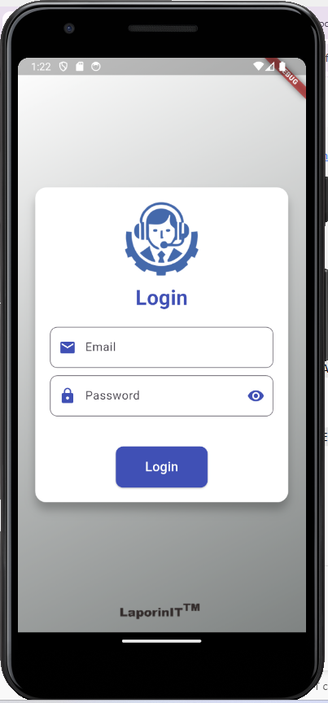
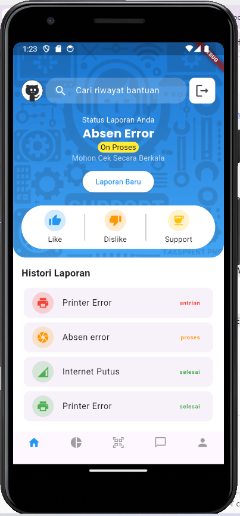

# IT Trouble Report App

## 📌 Overview
IT Trouble Report App is a Flutter-based mobile application that allows users to report information technology issues. The app provides an intuitive UI, authentication, and issue tracking features to streamline IT support requests.

## 🚀 Features
- 📲 **User Authentication** (Sign up, Login, Logout)
- 📝 **Report IT Issues** (Title, Description, Screenshot Upload)
- 📌 **Track Issue Status** (Pending, In Progress, Resolved)
- 🔔 **Notifications** (Updates on Issue Progress)
- 📊 **Admin Dashboard** (Manage & Assign Issues)
- 🌐 **Multi-language Support**
- 🎨 **Modern UI with Animations**

## 🛠️ Tech Stack
- **Flutter** (Dart)
- **Firebase / Supabase** (Authentication & Database)
- **Provider / Riverpod / Bloc** (State Management)
- **REST API / GraphQL** (Backend Communication)
- **Hive / Shared Preferences** (Local Storage)
- **Fastlane / Codemagic** (CI/CD for Deployment)

## 📂 Project Structure
```
📦 it_trouble_report_app
 ┣ 📂 android
 ┣ 📂 assets
 ┣ 📂 build
 ┣ 📂 ios
 ┣ 📂 lib
 ┃ ┣ 📂 components
 ┃ ┃ ┗ 📜 logout_confirmation_dialog.dart
 ┃ ┣ 📂 pages
 ┃ ┃ ┣ 📂 home
 ┃ ┃ ┃ ┗ 📜 home.dart
 ┃ ┃ ┣ 📂 login
 ┃ ┃ ┃ ┣ 📜 login.dart
 ┃ ┃ ┃ ┣ 📜 login_handle.dart
 ┃ ┃ ┃ ┣ 📜 logout_handle.dart
 ┃ ┃ ┃ ┗ 📜 token_check.dart
 ┃ ┗ 📜 main.dart
 ┣ 📂 linux
 ┣ 📂 macos
 ┣ 📂 web
 ┣ 📂 windows
 ┣ 📜 .gitignore
 ┣ 📜 .metadata
 ┣ 📜 analysis_options.yaml
 ┣ 📜 native_splash.yaml
 ┣ 📜 pubspec.lock
 ┣ 📜 pubspec.yaml
 ┣ 📜 README.md
```

## 🏗️ Installation

## 🔑 Demo Credentials
- **Username:** user1@demo.com
- **Password:** 123456

1. **Clone the repository**
   ```sh
   git@github.com:aryanando/hasta_laporin_it.git
   cd hasta_laporin_it
   ```
2. **Install dependencies**
   ```sh
   flutter pub get
   ```
3. **Run the app**
   ```sh
   flutter run
   ```

## 🖼️ Screenshots



## 🎯 Contribution
Contributions are welcome! Feel free to open issues or submit pull requests.

## 📄 License
This project is licensed under the MIT License.

## 📞 Contact
For any inquiries, please contact aryanando232@gmail.com or open an issue in the repository.

